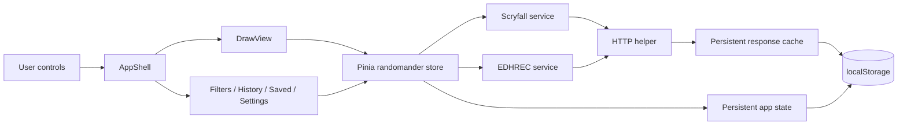
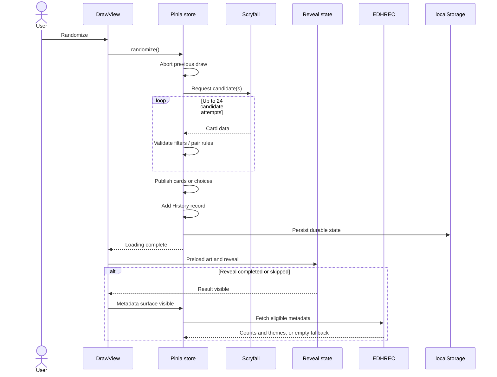

# Randomander architecture

This document explains how the current application is assembled, where behavior belongs, and which contracts should remain stable when it changes. It describes the runtime code, not unused scaffold components or historical design plans.

For product behavior, read the [User guide](user-guide.md). For repository workflow, read [Contributing](../CONTRIBUTING.md).

## System at a glance

Randomander is a static Vue single-page application. It has no application backend, account system, database, service worker, or client-side router.



The central Pinia store is intentionally broader than a passive state container. It is the current application/domain layer: it constructs queries, owns draw workflows, validates pair compatibility, records results, schedules metadata, controls support panels, and persists durable state.

## Runtime topology

Startup is deliberately small:

1. `src/main.ts` creates Vue, installs Pinia, initializes Vercel Analytics, and mounts `App`.
2. `src/App.vue` renders `AppShell`.
3. `src/app/AppShell.vue` applies theme/performance behavior and always renders `DrawView`.
4. Filters, History, Saved, and Settings render above Draw as modal surfaces.

There is no Vue Router. Store fields such as `activePanel` describe visible UI surfaces, not browser routes. Do not add route-oriented assumptions to records, tests, or links unless routing is introduced as a deliberate feature.

When a modal is open, the shell marks the underlying application content inert and hidden from assistive technology. `SupportPanel` and `useModalFocus` handle focus containment, Escape, and focus restoration.

## Source ownership

| Path | Responsibility |
| --- | --- |
| `src/app/` | Root responsive shell, navigation, modal composition, and global loading-overlay composition. |
| `src/features/draw/` | Main draw experience, reveal state machine, result layout, choices, deck inspiration, and draw-specific presentation helpers. |
| `src/features/history/` | Recent-record list and load/save/clear actions. |
| `src/features/saved/` | Saved-record list and load/remove/clear actions. |
| `src/features/settings/` | Theme, display, price, performance, cache, and history entry points. |
| `src/components/layout/` | Reusable modal/panel/loading layout primitives. |
| `src/components/mtg/` | Mana identity and Scryfall symbol presentation. |
| `src/composables/` | Cross-feature UI behavior such as theme application and modal focus. |
| `src/stores/randomander.ts` | Domain types/defaults, queries, workflows, state, records, panels, and persistence. |
| `src/services/http.ts` | JSON fetch boundary, optional persistent cache, and normalized HTTP errors. |
| `src/services/scryfall.ts` | Scryfall endpoints, request pacing/cooldown, ranked selection, and abort behavior. |
| `src/services/edhrec.ts` | EDHREC URL construction, response parsing, deck counts, and themes. |
| `src/lib/scryfall.ts` | Scryfall card model and pure card/type/pair/slug/marketplace-price helpers. |
| `src/lib/cache.ts` | TTL-based persistent response cache and entry pruning. |
| `src/lib/storage.ts` | Safe local-storage parsing/writing/removal wrappers. |
| `src/__tests__/` | App behavior, service policy, parsing, helpers, and focused components. |
| `src/style.css` | Tailwind import, design tokens, shared Material-inspired classes, and global motion rules. |

Keep feature-only code close to its feature. Move a concept to `components`, `composables`, `lib`, or `services` only when it has a genuine cross-feature or boundary responsibility.

## State model

The store contains three broad categories.

### Durable state

These values are serialized to `randomander:state:v2`:

- current mode and filter options;
- display preferences, including the selected price marketplace;
- cache settings;
- performance preferences;
- theme;
- History records;
- Saved records;
- the restorable support-panel location for History or Saved.

Filters and Settings panel visibility are transient. The current result is captured through successful History records; it is not persisted as a separate standalone session object.

### Ephemeral state

These values exist only for the current runtime:

- current `cards` and `choices` result arrays;
- Spark palette;
- loading and error state;
- active `AbortController` instances;
- whether the metadata surface is visible;
- in-memory EDHREC metadata/tag lookup;
- reveal progress, which is local to `DrawView` rather than Pinia.

### Derived state

Computed values translate domain state into UI-facing behavior:

- store-level summary chips and mode/filter labels;
- draw-stage headings and status text;
- Scryfall query fragments;
- allowed/selected color sets;
- choice and companion button labels;
- current/saved record fingerprints;
- EDHREC slugs and theme URLs.

DrawView separately derives its visible active-filter count and chips from store options. Presentation copy currently lives partly in the store because it depends directly on domain state. When adding copy, prefer concise labels and avoid duplicating the same explanation across headings, subtitles, and cards.

## Draw lifecycle



### Request cancellation

Every draw or follow-up pairing creates a new `AbortController` and aborts the prior one. Aborted work does not become a user-visible draw error. Components that initiate new workflows should call existing store actions rather than bypassing this policy.

### Candidate bounds

Filtered random selection attempts at most 24 candidates. This avoids an infinite loop when filters describe an empty or extremely rare pool. A failure should remain actionable: the UI tells the user that no matching result was found so filters can be relaxed.

### History timing

A successful top-level draw is recorded after its result is complete. Adding a companion/background also creates a new record. Failed and aborted operations do not create records.

## Draw pipelines

### Commander pipeline

The base query requires `is:commander legal:commander`. The store adds the applicable color query, then chooses one of two Scryfall strategies:

- normal mode uses Scryfall's random endpoint;
- ranked cutoff uses a paginated search ordered by EDHREC rank and samples after the first 10%.

Client-side checks enforce the selected color rules and, when enabled, the EDHREC deck threshold.

Choice mode produces two options and retries overlap up to six times, then publishes two `CommanderChoice` groups rather than the normal `cards` array. Non-overlap is therefore best-effort for a very small eligible pool.

### Partner-pair pipeline

The store selects a partner-capable primary card, identifies its mechanic, and resolves the compatible card. Every completed group must pass the combined color-identity rules.

| Detected primary | Resolution strategy |
| --- | --- |
| Generic Partner | Find another generic Partner of the supported variant, excluding the same card. |
| Partner with | Parse the named card from oracle text and perform an exact-name lookup. |
| Choose a Background | Draw a legendary Background. |
| Friends forever | Draw a different Friends forever card. |
| Doctor's companion | Draw an eligible Doctor commander. |

The reverse direction begins with a legendary Background returned by Commander mode (including a Commander choice). Its **Find commander** follow-up uses a separate query for a commander with Choose a Background. Partner mode does not select a plain Background as its initial primary. Successful Background pair results use canonical order:

```text
[commander with Choose a Background, legendary Background]
```

Maintaining that order keeps primary-card rendering assumptions, headings, History records, and detail components predictable. Pair slugs and fingerprints sort their inputs independently.

Named partner lookups can use the persistent response cache; live random candidate requests do not.

### Spark pipeline

Spark fetches three Commander-legal cards and retries duplicates up to six times per later card. Uniqueness is best-effort for a very small eligible pool. A numeric color selection can first produce a random palette constrained by the chosen colors. Optional Game Changer exclusion is added to the query.

The store disables incompatible options when Spark becomes active:

- choice mode;
- EDHREC deck-limit filtering;
- ranked cutoff.

EDHREC display metadata is also suppressed for Spark results. Scryfall card links and normal result presentation remain available.

### Choice groups

`CommanderChoice` is the grouping boundary for choice mode. A choice has its own stable ID and card array. Code that presents, enriches, records, or fingerprints choice results must preserve these boundaries.

This matters most for deck inspiration. Passing all cards as one group would incorrectly combine pair slugs and metadata. The Draw view instead renders one `ResultDetailsSection` for each choice and passes that choice's card array as both the visible cards and metadata group.

Follow-up pairing replaces only `choices[index]` and then records the full updated choice list.

## Reveal and metadata lifecycle

Reveal state belongs to `DrawView` because it is view timing, not persisted domain state.

The active result key combines result card IDs with the newest History ID. A new key resets the reveal, even if a repeated Scryfall result happens to contain the same card IDs.

The reveal lifecycle is:

1. wait for the draw request to finish;
2. preload usable card images, with a four-second safety timeout;
3. run a fixed 2.4-second overall reveal sequence;
4. allow Skip or Escape to complete it early;
5. focus the result heading after an explicit skip;
6. expose links/actions and mark the metadata surface visible;
7. fetch EDHREC metadata only when enabled and relevant.

The total reveal duration remains fixed while individual cards receive staggered animation offsets. Application reduced motion, system `prefers-reduced-motion`, or disabling Card reveal animation bypasses most of the sequence.

Post-reveal metadata requests are therefore non-blocking decoration. They do not determine whether a Scryfall result is considered successful. The optional deck-threshold filter is a separate pre-result path that depends on a usable EDHREC count and can fail the draw.

## External service boundaries

### Generic HTTP helper

`src/services/http.ts` is the common JSON boundary. It:

- checks the optional persistent cache before a request;
- sends an abort signal to `fetch`;
- parses JSON for successful responses;
- throws a normalized `HttpError` for non-2xx responses;
- retains `Retry-After` information;
- writes eligible successful responses to cache.

Keep endpoint-specific schema handling out of this generic layer.

### Scryfall adapter

`src/services/scryfall.ts` owns upstream courtesy and failure policy:

- request starts are globally spaced by at least 150 ms;
- queued requests can be aborted before starting;
- HTTP 429 starts an in-memory cooldown of at least 60 seconds or the longer upstream `Retry-After`;
- a network/CORS `TypeError` starts a 60-second cooldown;
- the cooldown is not a retry loop—new calls fail until it expires;
- random, exact-name, and ranked-search operations expose domain-sized functions to the store.

The pacing queue and cooldown are module-level state. Service tests reset modules and use fake timers so cases cannot contaminate one another.

Scryfall card payloads also carry nullable marketplace price fields and purchase URIs. `getCardPrice` maps Cardmarket to EUR, TCGplayer to USD, and Cardhoarder to tix, with labelled same-marketplace finish fallbacks. This is pure presentation data from the existing draw response; selecting another marketplace does not start a request.

### EDHREC adapter

`src/services/edhrec.ts` requests commander JSON pages and tolerates more than one observed response schema. It extracts:

- a deck count when recognized;
- at most four theme entries;
- normalized labels, absolute theme URLs, and optional theme slugs.

Pair pages use an alphabetical card-name slug. A parsing or network failure in post-reveal enrichment degrades to empty optional metadata; the same failure during deck-threshold filtering propagates to the draw.

EDHREC is not used as a legality authority. Scryfall card data and the store's compatibility rules determine the draw.

## Cache and persistence contracts

### Application state

Key: `randomander:state:v2`

The serialized payload includes full card snapshots inside History and Saved records. This makes old records resilient to immediate network availability, although artwork URLs and reloaded metadata still depend on external hosts. Price fields in those snapshots can become stale; they are not refreshed when a record is loaded.

New History and Saved insertions are each capped at 40. Saves are deduplicated by a fingerprint built from mode and sorted card/group identities.

Storage access is wrapped in safe helpers. Parse, quota, or security failures log a warning and allow the in-memory app to continue. There is no remote backup.

The current loader does not perform formal runtime schema validation or migration beyond the versioned key and default merging. Changes to persisted shapes should therefore be backward-compatible or introduce an explicit migration/version plan.

### Response cache

Key: `randomander:cache:v1`

Each entry stores response data and an update timestamp. Reads lazily remove expired entries. Writes prune the oldest-written entries when the configured maximum is exceeded.

Defaults:

- enabled;
- 24-hour TTL;
- 120 entries.

Current persistent-cache consumers are EDHREC metadata and exact-name Scryfall requests. Random and ranked Scryfall selection stays live.

Clearing persistent cache does not clear the store's current in-memory metadata map. The user may need to reload after clearing when diagnosing already-rendered stale metadata.

## UI composition and responsive behavior

`AppShell` owns the global surfaces:

- sticky phone header;
- desktop navigation rail;
- mobile bottom navigation;
- Draw content inset/padding;
- support panels;
- Filters modal;
- loading overlay;
- global theme and performance classes.

`DrawView` uses a single-column layout at small widths, adds a draw-control column at large widths, and adds a third deck-inspiration column at extra-large widths. On intermediate desktop widths, Deck inspiration moves below the result. On mobile, draw controls collapse while the Randomize button remains fixed above bottom navigation and safe-area insets.

The main result components are:

- `HeroStage` for normal card/pair/Spark results;
- `ChoiceOptionsSection` for two independent options;
- `PrestigeCard` for card art and reveal state;
- `DrawBackdrop` for optional ambient artwork;
- `ResultDetailsSection` for card/pair profile, links, counts, and themes.
- `CardPriceBadge` for a compact per-card estimate and optional marketplace link.

Avoid introducing a second metadata presentation path. Improvements to deck details should usually happen in `ResultDetailsSection`, with grouping decisions left to `DrawView`.

## Accessibility contracts

Preserve these behaviors during UI changes:

- modal focus is trapped and returned to the opener;
- Escape has a deterministic action;
- the background is inert while a modal is active;
- labels/headings identify modal, navigation, result, and details regions;
- loading and errors are announced through status/alert semantics;
- expanded/collapsed and selected controls expose state;
- touch targets remain usable on small screens;
- system and application reduced-motion preferences bypass decorative sequences;
- hidden reveal content is not prematurely exposed as completed content.

Test keyboard behavior as interaction, not only as markup inspection.

## Testing strategy

Vitest runs in jsdom with global test functions and Testing Library's jest-dom matchers.

| Test area | Current purpose |
| --- | --- |
| `src/__tests__/App.test.ts` | Integrated component behavior around modal focus, responsive controls, draw modes, pair/Background flows, choices, reveal, settings persistence, errors, and mocked APIs. |
| `src/__tests__/services/scryfall.test.ts` | Request spacing, cooldown, abort, and cached exact-name request policy. |
| `src/__tests__/services/edhrec.test.ts` | Modern and legacy metadata schema parsing. |
| `src/__tests__/lib/scryfall.test.ts` | Card helpers, slugs, Background detection, and partner parsing. |
| `src/__tests__/components/` | Focused loading/reveal component behavior. |

The production build runs `vue-tsc -b` before Vite. The application TypeScript configuration excludes test files, so passing `npm run build` does not replace running Vitest.

For changes to draw logic, prefer a pure-helper test for classification/slug rules plus an app or store-level behavior test for the complete workflow. For service policy, mock `fetch`, use fake timers where pacing is involved, and keep tests independent of live upstream APIs.

## Adding or changing behavior

### A new draw constraint

1. Extend the option type and defaults in the store.
2. Decide which modes support it and enforce incompatibilities in watchers/UI disabled states.
3. Add the narrowest possible Scryfall query fragment.
4. Add a client-side validation when upstream search cannot fully express the rule.
5. Include it in record snapshots, persistence, filter chips, and reset behavior.
6. Add tests for supported modes, incompatible modes, and empty pools.
7. Update the README filter matrix and User guide.

### A new partner-style mechanic

1. Add or extend pure classification helpers in `src/lib/scryfall.ts`.
2. Define the pool query and compatibility rules in the store.
3. Validate combined colors and uniqueness.
4. Define canonical result order.
5. Update companion labels and EDHREC slug behavior if needed.
6. Cover both top-level Partner mode and Commander follow-up/Choice flows.
7. Add helper and integration tests, then update the compatibility tables.

### A new persisted preference

1. Add its type and default.
2. Merge old persisted data safely.
3. Add it to the deep persistence watcher payload.
4. Confirm Reset/Clear actions have the intended scope.
5. Test reload behavior and malformed/missing old values.
6. Document its storage/privacy impact.

## Known boundaries

- There is no formal persistence schema validator or migration registry.
- There is no router, server-side rendering, service worker, or offline application shell.
- The central store owns substantial orchestration; splitting it should be an intentional refactor with behavior coverage, not incidental churn during a feature.
- Scryfall and EDHREC schemas/availability are external dependencies.
- Response-cache pruning happens on writes, and expiration cleanup happens on reads.
- Clearing persistent cache does not clear already memoized metadata until reload.
- There is no lint, formatter, coverage, or deployment command in `package.json`.
- A few scaffold or earlier-iteration components may exist without runtime imports; do not treat them as part of the canonical component tree.

When architecture and implementation disagree, the implementation and tests describe current behavior. Update this document in the same pull request once the new behavior is deliberate and verified.
